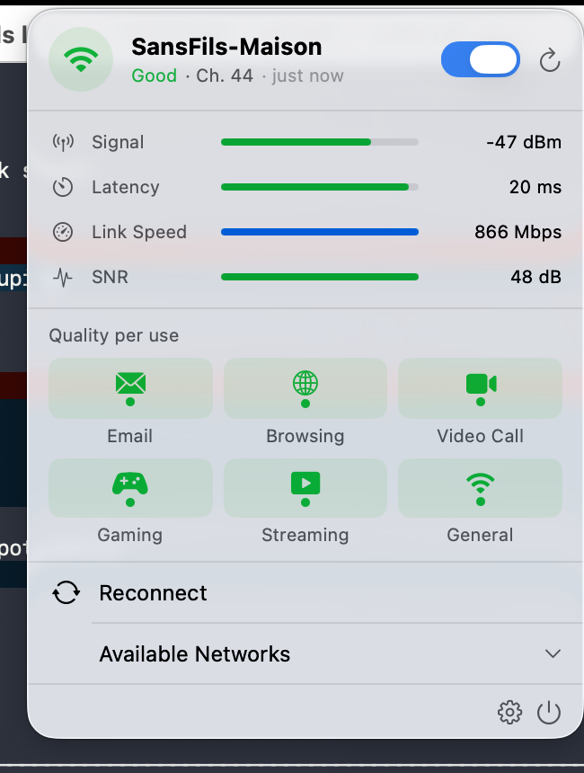
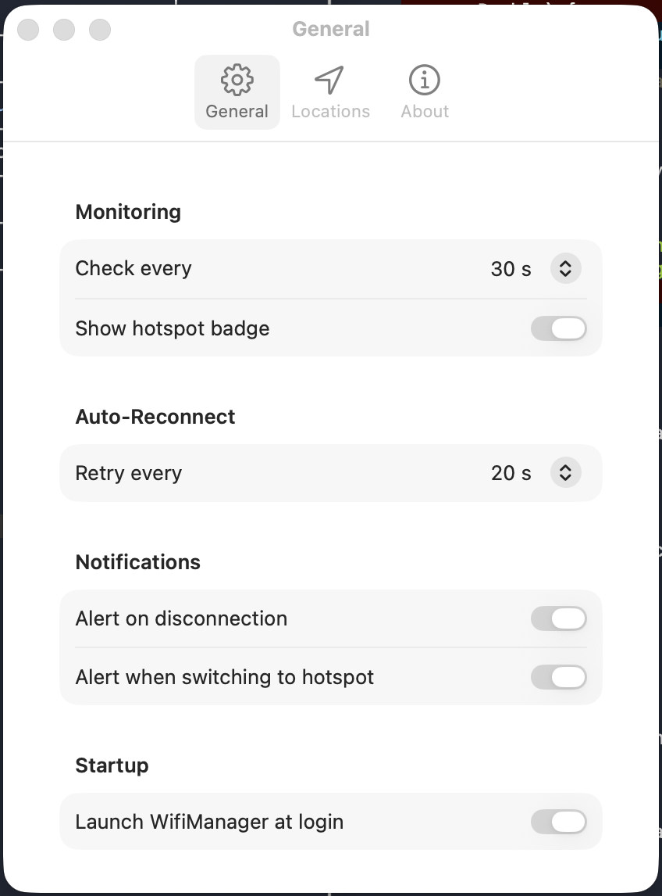

# WifiManager


A lightweight macOS menu bar app that monitors your WiFi connection quality in real time, distinguishes real networks from iPhone hotspots, and scores connection suitability per use case.

<p align="center">
  
  &nbsp;&nbsp;
  
</p>

---

## Download

**[WifiManager-1.1.0.dmg](https://github.com/vincentlauriat/WifiManager/releases/download/v1.1.0/WifiManager-1.1.0.dmg)** — macOS 14+ · Developer ID signed · Notarized by Apple

Open the DMG, drag WifiManager to Applications, and launch. No configuration needed.

---

## Features

| Feature | Description |
|---|---|
| Live signal metrics | RSSI, latency, link speed, SNR with animated bars |
| Hotspot detection | Automatically detects iPhone Personal Hotspot via `NWPathMonitor` |
| Usage scores | Per-use quality rating: Email, Browsing, Video Call, Gaming, Streaming |
| Network scanner | Lists nearby WiFi networks grouped by SSID; join directly with password prompt |
| WiFi toggle | Enable or disable WiFi from the menu bar popover |
| Auto-reconnect | Automatically retries connection when disconnected (configurable interval) |
| Launch at login | Start WifiManager automatically at login via `SMAppService` |
| Location profiles | Save location/SSID pairs for automatic network suggestions |
| Replace system icon | Guide to hide the native macOS WiFi icon and use WifiManager instead |
| FR / EN interface | Language switcher in Preferences → General |
| Auto-update | Sparkle 2 integration — prompted on new releases, never silent |
| Menu bar icon | Color-coded icon (green / orange / red) with searching pulse animation |

---

## Tech Stack

| Layer | Technology |
|---|---|
| UI | SwiftUI (macOS 14+) |
| WiFi scanning & events | CoreWLAN (`CWWiFiClient`, `CWEventDelegate`) |
| Network path | Network framework (`NWPathMonitor`) |
| Location | CoreLocation |
| Auto-update | [Sparkle 2](https://sparkle-project.org) |
| Project generation | [XcodeGen](https://github.com/yonaskolb/XcodeGen) |

---

## Build from source

### Requirements

- macOS 14.0 Sonoma or later
- Xcode 16+
- [XcodeGen](https://github.com/yonaskolb/XcodeGen) (`brew install xcodegen`)

```bash
git clone https://github.com/vincentlauriat/WifiManager.git
cd WifiManager
./Scripts/build.sh
```

---

## Project Layout

```
WifiManager/
├── project.yml                        # XcodeGen project spec
├── appcast.xml                        # Sparkle update feed (auto-generated by release.sh)
├── Scripts/
│   ├── build.sh                       # Debug build
│   ├── release.sh                     # Full release pipeline (sign → notarise → DMG → Sparkle)
│   ├── fetch-sparkle-tools.sh         # One-time Sparkle tools download
│   └── make-dmg-background.swift      # Generates DMG background image
└── WifiManager/
    ├── Info.plist
    ├── Resources/
    │   └── Assets.xcassets/
    └── Sources/
        ├── AppLanguage.swift              # Language enum + LanguageManager
        ├── Strings.swift                  # All localised strings (FR/EN)
        ├── WifiManagerApp.swift           # App entry point, Sparkle setup, animated icon
        ├── WiFiMonitor.swift              # CoreWLAN + CWEventDelegate + NWPathMonitor
        ├── NetworkStatus.swift            # ConnectionStatus, NetworkQuality, NetworkMetrics
        ├── NetworkQualityChecker.swift
        ├── ConnectionTypeDetector.swift
        ├── UsageProfile.swift             # UsageType with per-usage quality scoring
        ├── LocationProfile.swift
        ├── LocationProfileManager.swift
        ├── MenuBarView.swift
        ├── StatusHeaderView.swift         # SSID + WiFi toggle + searching animation
        ├── MetricsView.swift
        ├── UsageScoresView.swift
        ├── NetworkListView.swift          # Networks grouped by SSID with AP count badge
        └── SettingsView.swift
```

---

## How Auto-Update Works

WifiManager uses [Sparkle 2](https://sparkle-project.org) for update checks.

1. On launch, Sparkle checks the appcast feed at:
   `https://raw.githubusercontent.com/vincentlauriat/WifiManager/main/appcast.xml`
2. If a newer version is available, a prompt asks the user before downloading.
3. Updates are **never** downloaded silently (`SUAutomaticallyUpdate = false`).
4. The user can also check manually via **Preferences → About → Check for Updates…**

### Publishing a release

```bash
./Scripts/release.sh <version>
# → builds Release, signs with Developer ID + Hardened Runtime
# → notarises with Apple, staples the ticket
# → packages a Finder-layout DMG
# → signs with Sparkle EdDSA, regenerates appcast.xml
# → prints the gh release create command
```

---

## Roadmap

- [x] Real-time WiFi metrics (RSSI, latency, SNR, link speed)
- [x] Hotspot detection
- [x] Usage quality scores
- [x] Network scanner with password join and SSID grouping
- [x] Location profiles
- [x] FR / EN localisation
- [x] Sparkle auto-update
- [x] Launch at login
- [x] WiFi toggle (enable/disable from menu bar)
- [x] Auto-reconnect when disconnected
- [x] Event-driven state updates (CWEventDelegate)
- [x] Notarized DMG release pipeline
- [ ] Download speed measurement
- [ ] Notification center alerts on disconnect / hotspot switch
- [ ] 24-hour RSSI and latency history chart
- [ ] iCloud sync for location profiles

---

## License

MIT — see `LICENSE` file (coming soon).
